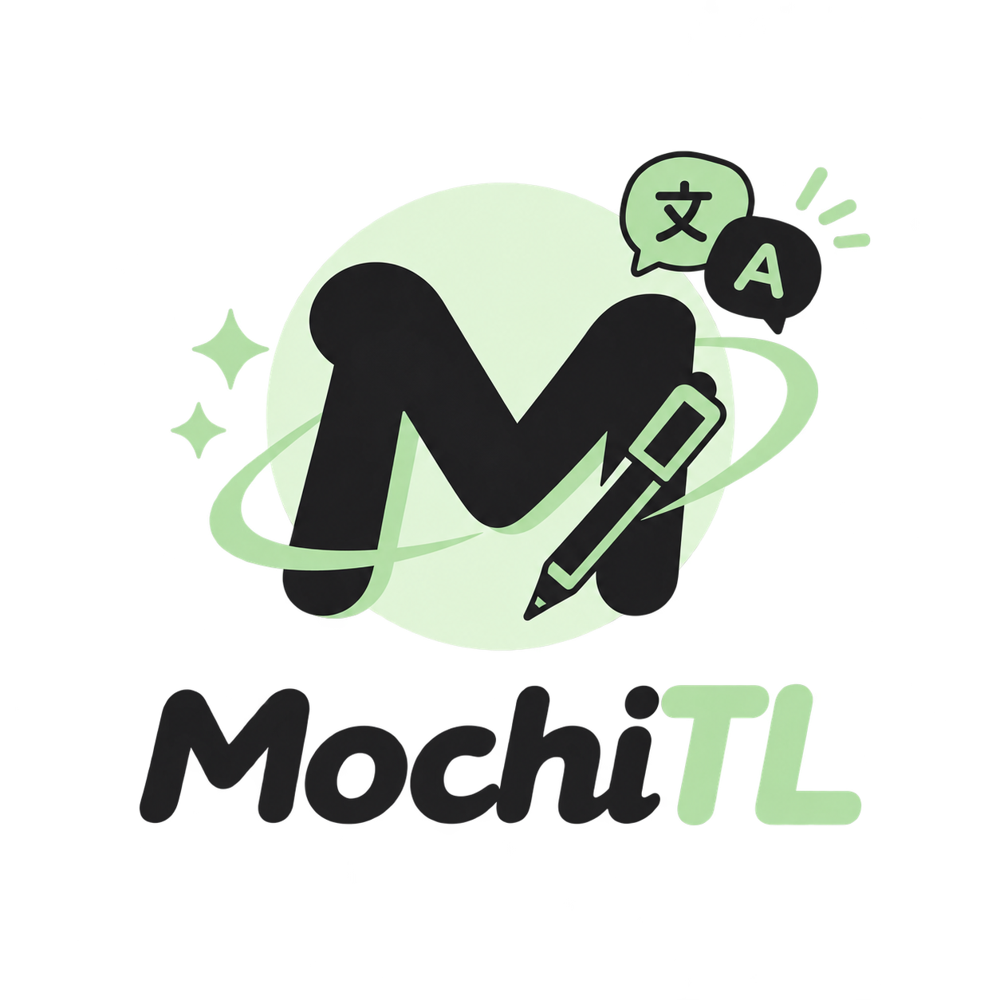

# MochiTL 🍡

[](LICENSE)
[](https://www.android.com/)
[](https://kotlinlang.org/)
[](#)

Aplikasi penerjemah AI untuk manga, manhwa, light novel, dan dokumen — dibangun dengan Kotlin Native + Jetpack Compose, terhubung ke Gemini, OpenAI, OpenRouter, Ollama, atau LM Studio.

<p align="center">
  
</p>

---

## 📸 Tampilan Antarmuka (UI Preview)

| Layar Utama / Penerjemah | Pengaturan Provider & Model | Prompt Manager & Glosarium |
| :---: | :---: | :---: |
|  |  |  |

---

## ✨ Fitur Utama

- 🌐 **Multi-Provider AI** — Terhubung ke Google Gemini, OpenAI, OpenRouter, serta server lokal (**Ollama** & **LM Studio**) dengan fitur uji koneksi dan pengambilan daftar model otomatis.
- 📄 **Penerjemahan Dokumen** — Membaca dan menerjemahkan file dokumen teks berformat **TXT**, **EPUB** (urutan baca spine), **DOCX**, dan **PDF**.
- 🧩 **Chunking Cerdas** — Pemotongan teks berbasis paragraf (~4000 karakter) untuk menjaga keutuhan konteks terjemahan tanpa memotong kalimat di tengah.
- 🔄 **Retry Otomatis & Resume** — Sistem percobaan ulang ber-backoff saat terjadi rate limit atau gangguan jaringan; hasil parsial yang sukses tetap tersimpan aman.
- 📝 **Prompt Manager & Kategori** — Template gaya bawaan (Novel/Fiksi, Komik/Webtoon, Akademik, Pembersih Teks OCR) + prompt kustom, pencarian, dan ekspor/impor JSON.
- 📚 **Glosarium Istilah** — Penyuntikan otomatis daftar istilah khusus (nama tokoh, jurus, lokasi) ke setiap prompt untuk menjaga konsistensi terjemahan.
- 🔒 **Keamanan & Anti-Injection Protocol** — API Key tersimpan aman terenkripsi via Android Keystore (`EncryptedSharedPreferences`), dan input pengguna dilindungi oleh protokol anti-prompt injection `<source_text>`.
- 📁 **Manajemen Proyek & Riwayat** — Pengelompokan terjemahan per-proyek yang mengikat provider, prompt, glosarium, dan bahasa target secara otomatis.

---

## 🖥️ Panduan Koneksi LLM Lokal (Ollama & LM Studio)

MochiTL mendukung penuh penerjemahan offline / mandiri menggunakan model LLM lokal di komputer Anda (seperti Llama 3, DeepSeek, Qwen, dll).

### 1. Persiapan Server Lokal di Komputer (PC/Laptop)
- **Ollama:** Pastikan Ollama berjalan dan dapat diakses dari jaringan lokal.
  ```bash
  # Di PC (Linux/macOS/Windows Subsystem):
  OLLAMA_HOST=0.0.0.0:11434 ollama serve
  ```
- **LM Studio:** Buka tab *Developer / Local Server* di LM Studio, nyalakan *Server Status* (port default `1234`), dan pastikan opsi *"Cross-Origin Resource Sharing (CORS)"* diaktifkan.

### 2. Hubungkan Android ke PC
1. Pastikan HP Android dan PC terhubung ke **jaringan Wi-Fi yang sama**.
2. Cari Alamat IP Lokal PC Anda (misalnya `192.168.1.5`):
   - **Windows:** Buka CMD, ketik `ipconfig` (lihat *IPv4 Address*).
   - **Linux / macOS:** Ketik `ifconfig` atau `ip a`.
3. Buka MochiTL di Android -> Masuk ke menu **Pengaturan Provider**:
   - Untuk **Ollama**: Masukkan Base URL `http://192.168.1.5:11434`
   - Untuk **LM Studio**: Masukkan Base URL `http://192.168.1.5:1234`
4. Tekan tombol **Tes Koneksi** untuk mengambil daftar model secara otomatis.

> 💡 *Tips (Menggunakan Ngrok / Tunneling):* Jika HP dan PC tidak berada dalam satu jaringan Wi-Fi, Anda dapat menggunakan ngrok di PC (`ngrok http 11434`) lalu memasukkan URLHTTPS dari ngrok ke dalam MochiTL.

---

## 📄 Format Dokumen yang Didukung & Batasan Saat Ini

Saat ini MochiTL berfokus pada penerjemahan berbasis teks:

| Format Dokumen | Status Dukungan | Catatan |
| :--- | :--- | :--- |
| **TXT** | ✅ Didukung Sepenuhnya | Teks polos UTF-8 |
| **EPUB** | ✅ Didukung Sepenuhnya | Mengekstrak teks sesuai urutan bab (spine) |
| **DOCX** | ✅ Didukung Sepenuhnya | Membaca dokumen Microsoft Word |
| **PDF** | ✅ Didukung Sepenuhnya | Ekstraksi teks native via PDFBox Android |
| **Manga / Manhwa (Gambar / CBZ / CBR)** | ⚠️ Memerlukan Teks Mentah | Gambar komik perlu diekstrak teksnya terlebih dahulu sebelum diimpor |

---

## 🗺️ Roadmap Fitur Masa Depan (v2.0)

Rencana pengembangan MochiTL versi berikutnya meliputi:
- [ ] **Dukungan Format Komik CBZ / CBR** — Pembongkaran arsip gambar komik secara langsung.
- [ ] **OCR Bawaan (Optical Character Recognition)** — Ekstraksi teks otomatis dari gambar manga/manhwa.
- [ ] **Image Overlay / Inpainting** — Penimpaan teks terjemahan secara langsung di atas gelembung teks (*speech bubble*) komik.
- [ ] **Eksportir EPUB Terjemahan** — Mengunduh kembali dokumen terjemahan dalam format EPUB utuh.

---

## 📦 Cara Mengunduh & Memasang APK

1. Buka halaman [**Releases**](../../releases) di repository ini.
2. Unduh file `.apk` versi terbaru (misalnya `mochitl-v1.0.1.apk`).
3. Buka file `.apk` di perangkat Android Anda, berikan izin *Install from Unknown Sources* jika diminta, dan ikuti petunjuk pemasangan hingga selesai.

---

## 👨‍💻 Untuk Pengembang & Kontributor

Ingin melakukan kompilasi sendiri, menjalankan unit test, atau memicu rilis CI/CD?
- 📖 **Panduan Pengembang & CI/CD:** Lihat [DEVELOPMENT.md](DEVELOPMENT.md)
- ⚙️ **Metadata & Pengaturan Repository:** Lihat [PROJECT_METADATA.md](PROJECT_METADATA.md)

---

## 📜 Lisensi

Aplikasi ini dirilis di bawah lisensi [MIT License](LICENSE).
